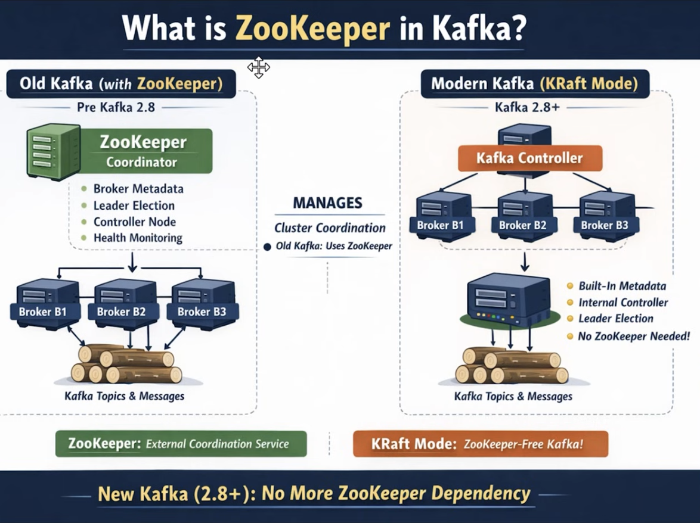
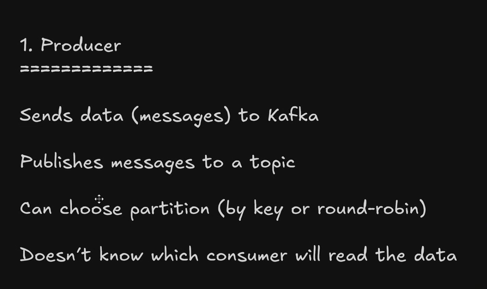
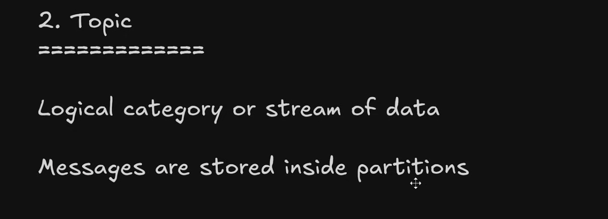
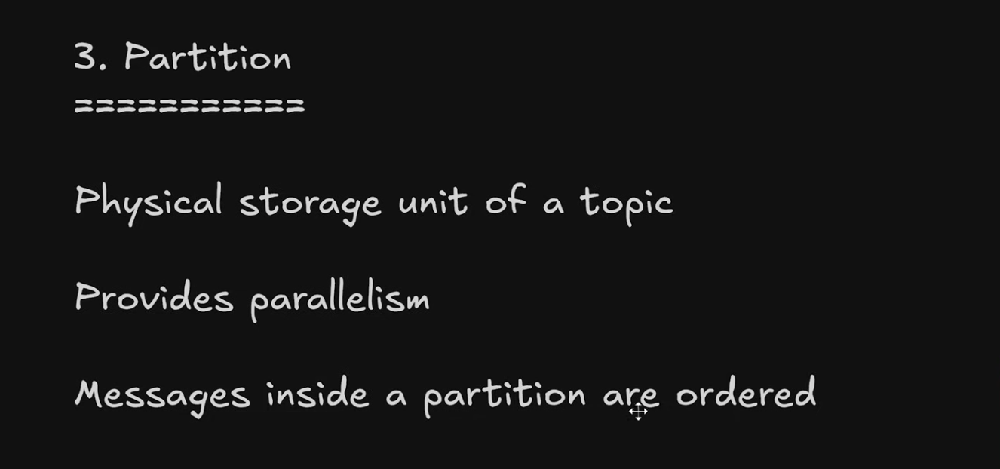
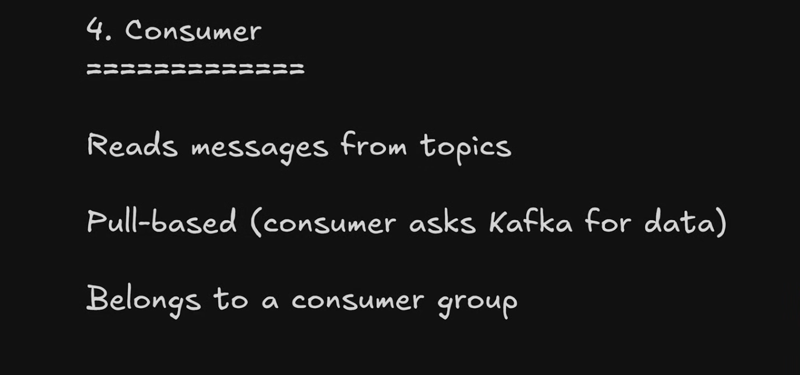
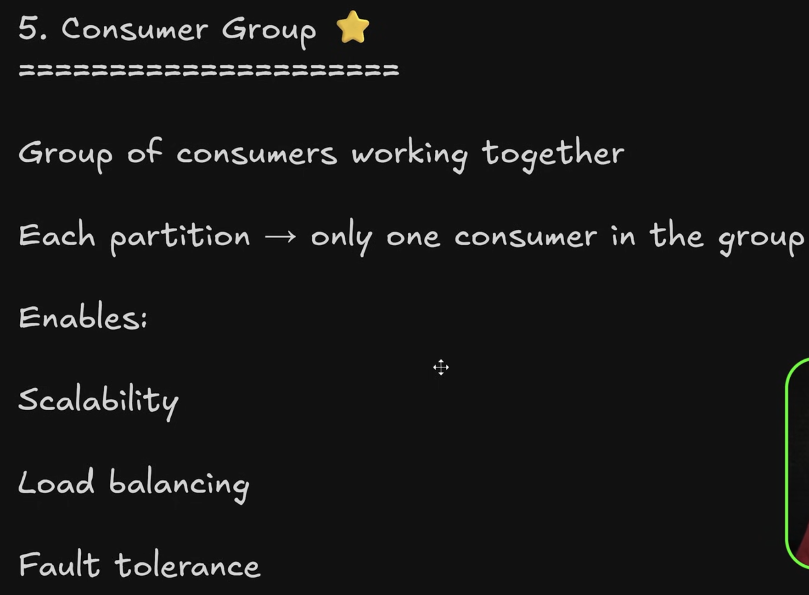
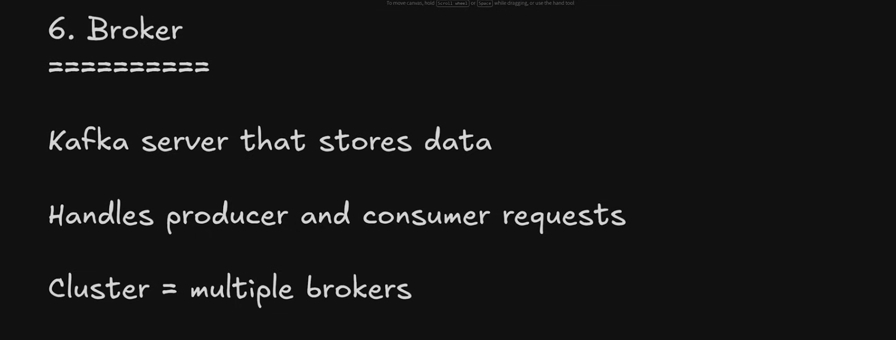
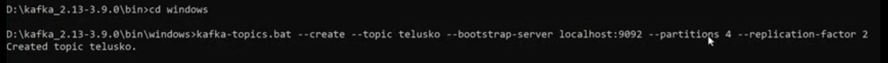

# Kafka_Repository
Kafka Repository
Message Oriented Middleware
Loose coupling between Microservices
- apache kafka, RabbitMQ
Process--
Producer(app)----publish--> Kafka Server/Broker(topic)----subscribe--> Consumer(app)

Benefits->
1. fast with lowest latency
2. real time streaming
3. high throughput(so much data can be pushed and consumed at once)
4. producer and consumer don't need to know about each other
5. fault tolerant
   

Structure->
One Kafka broker can have multiple topics.
Each topic can have multiple partitions
One partition can be connected to one Consumer only in One consumer group, but one consumer can be connected to multiple partitions, so the number of consumers in a Consumer group can't be more than the number of partitions in One topic. Ex: Suppose one data is published in one partition, may be the data is "Order placed", if two consumers are consuming from the same partition, it may result into two  "Order placed" notification, which is inconsistent.
But if two consumers are from different Consumer groups then they can be connecetd to one partition.
When publisher/producer is publishing, then normally they can't decide which partition the message will get published to, it followes Round Robin Manner, but if partition key is mentioned, then a particular partition only it will go.

Kafka Cluster->
Fault tolerance mechanism->
Kafka cluster can have multiple Kafka brokers. Kafka broker can have multiple topics. Topic can have multiple partitions.
A partition belongs to exactly ONE topic.
So:
topic-1, partition-0 has one leader and replicas (followers) on other brokers
Followers are replicas of the SAME partition, not other topics.
Example: 3 brokers, 1 topic, replication factor = 3
Topic: orders
Partitions: P0, P1
Broker layout
Broker 1:
  orders-P0 (LEADER)
  orders-P1 (FOLLOWER)

Broker 2:
  orders-P0 (FOLLOWER)
  orders-P1 (LEADER)

Broker 3:
  orders-P0 (FOLLOWER)
  orders-P1 (FOLLOWER)
Key points:
Same partition exists on multiple brokers as replicas
Only one leader per partition
Followers just copy data
Why do producers & consumers talk only to the leader?
✨ Reason 1: Ordering guarantee

If multiple brokers accepted writes:
Message order would break
Consistency would be impossibleSo:

Leader = single source of truth

✨ Reason 2: Simpler consistency model
Leader:
Handles reads & writes
Followers:
Replicate
Stay in sync
Take over if leader dies

✨ Reason 3: Fault tolerance
If:
Broker 1 crashes

Kafka:
Elects a follower as new leader
Clients automatically switch
No data loss (if configured correctly).
So what do followers actually do?

Followers:
Fetch data from leader
Acknowledge replication
Do NOT serve clients
Standby for failover
Where does the client connect?
Producer / Consumer flow:
Client connects to any broker (bootstrap)
Kafka returns metadata
Client then directly talks to:

Leader of partition X
Leader of partition Y

Clients are leader-aware.
One-line interview answer (gold)

“In Kafka, producers and consumers communicate only with the leader of a partition. Followers are replicas of the same partition used for fault tolerance and leader election, not separate topic partitions.”

Final mental model (lock this in)
Topic → divided into partitions
Partition → replicated across brokers
One partition → one leader → many followers
Clients → talk to leaders
Followers → replicate + failover

ZooKeeper->
ZooKeeper is a distributed coordination service used by Kafka for leader election, broker coordination, and metadata management.
KRaft = Kafka Raft metadata mode

It’s Kafka’s built-in replacement for ZooKeeper.
ZooKeeper era → Kafka + external referee
KRaft era → Kafka runs its own referee
Metadata log → rulebook everyone agrees on

Reference->
Producer-> 
Topic-> 
Partition-> 
Consumer-> 
Consumer Group-> 
Broker-> 

Offset->
A unique, sequential number assigned to each message within a partition.
Offsets allow Kafka to:
Preserve order (within a partition)
Track what has been consumed
Resume consumption after failure
Support multiple consumer groups independently

Kafka tracks offsets like this:
(group.id, topic, partition) → offset
So:
Group A may be at offset 10
Group B may still be at offset 0
Same data, different progress

Command to run->
zookeeper with properties

command to run kafka brker
kafka-topics.sh --create --topic kafkaTest --bootstrap-server localhost:9092 --partitions 4 --replication-factor 1

here kafkaTest is the topic name which will have four partitions and kafka server is running on 9092 and we have only one broker as of now that's why replication factor is 1

command to get description
kafka-topics.sh --describe kafkaTest --bootstrap-server localhost:9092